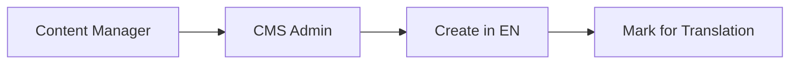
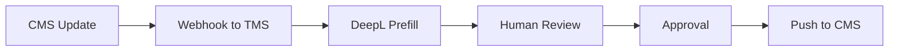
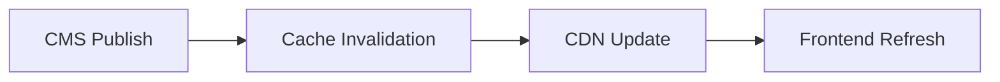

# Translation Best Practices Implementation

This document outlines the comprehensive translation system implemented in your application, following industry best practices for scalability, maintainability, and user experience.

## 🏗️ Architecture Overview

### **Multi-locale CMS as Source of Truth**
- **Content Storage**: All page/content copy stored in CMS with per-locale fields
- **Localization**: Slugs, SEO meta, and media/alt text localized per locale
- **API Design**: Frontend fetches `/api/cms/home?locale=<lng>` and never mixes UI keys with content

### **UI vs Content Separation**
- **UI Strings**: Only interface chrome in i18n (buttons, nav, tooltips, form labels)
- **Content**: Never hardcoded in code; never pasted into UI keys
- **ICU Messages**: Plural, gender, interpolation via i18next for UI

## 🌍 Supported Languages

| Language | Code | Status | RTL Support |
|----------|------|--------|-------------|
| English  | `en` | ✅ Complete | ❌ |
| Spanish  | `es` | ✅ Complete | ❌ |
| French   | `fr` | 🚧 Ready | ❌ |
| German   | `de` | 🚧 Ready | ❌ |
| Italian  | `it` | 🚧 Ready | ❌ |
| Portuguese| `pt` | 🚧 Ready | ❌ |
| Arabic   | `ar` | 🚧 Ready | ✅ |

## 📁 File Structure

```
server/
├── config/
│   └── i18n.js                    # i18next configuration
├── locales/
│   ├── en/                        # English translations
│   │   ├── common.json            # General responses
│   │   ├── auth.json              # Authentication messages
│   │   ├── api.json               # API responses
│   │   ├── validation.json        # Validation errors
│   │   ├── email.json             # Email templates
│   │   └── business.json          # Business-specific content
│   ├── es/                        # Spanish translations
│   └── [other languages]/
├── controllers/cms/
│   ├── page.controller.js         # General page content
│   ├── home.controller.js         # Home page specific
│   └── webhook.controller.js      # TMS and cache webhooks
├── services/
│   └── tms.service.js             # Translation management
└── utils/
    ├── translation.js              # Translation utilities
    └── response.js                 # Enhanced responses

app/
├── lib/
│   ├── i18n.js                    # Frontend i18next setup
│   └── resources.js               # UI translations only
└── routes/
    └── home.jsx                   # CMS-driven content
```

## 🚀 Key Features Implemented

### 1. **Field-Level Fallback Chain**
```javascript
// Locale fallback: de-CH → de → en
const fallbackChain = buildFallbackChain(locale);

// Field-level fallbacks for missing content
const resolvedContent = applyFieldLevelFallbacks(page.data, candidates, fallbackChain);
```

### 2. **CMS-Driven Content**
```javascript
// Frontend fetches content from CMS
const cmsPromise = fetch(`${url.origin}/api/cms/home?locale=${lng}`);

// No fallbacks to UI i18n - shows skeleton/placeholder instead
{cms?.hero?.badge || <span className="animate-pulse bg-muted">Loading...</span>}
```

### 3. **Proper SEO Headers**
```javascript
// Content-Language and Vary headers
res.set({
  'Content-Language': resolvedLocale,
  'Vary': 'Accept-Language',
  'Cache-Control': 'public, max-age=300, s-maxage=3600'
});

// Hreflang and canonical in frontend
<link rel="alternate" hrefLang="en" href="/" />
<link rel="alternate" hrefLang="es" href="/?lng=es" />
<link rel="canonical" href={lang === 'en' ? '/' : `/?lng=${lang}`} />
```

### 4. **Cache Invalidation Webhooks**
```javascript
// Triggered on CMS updates
POST /api/cms/webhooks/cache-invalidation
{
  "type": "CMS_UPDATE",
  "slug": "home",
  "locale": "es",
  "timestamp": "2024-01-01T00:00:00Z"
}
```

### 5. **TMS Integration Framework**
```javascript
// DeepL prefill
const translatedText = await tmsService.prefillWithDeepL(
  sourceText, 'en', 'de', { formality: 'formal' }
);

// Push to TMS
await tmsService.pushToTms(projectId, 'en', content, metadata);

// Pull from TMS
const translations = await tmsService.pullFromTms(projectId, 'de');
```

## 🔧 Configuration

### Environment Variables
```bash
# DeepL API for machine translation prefill
DEEPL_API_KEY=your-deepl-api-key
DEEPL_API_URL=https://api-free.deepl.com/v2

# TMS integration
TMS_WEBHOOK_URL=https://your-tms.com/webhooks
TMS_API_KEY=your-tms-api-key

# Cache invalidation
CACHE_INVALIDATION_WEBHOOK_URL=https://your-cdn.com/invalidate
```

### i18next Configuration
```javascript
// server/config/i18n.js
{
  fallbackLng: 'en',
  supportedLngs: ['en', 'es', 'fr', 'de', 'it', 'pt', 'ar'],
  detection: {
    order: ['querystring', 'cookie', 'header', 'session'],
    caches: ['cookie']
  },
  ns: ['common', 'auth', 'api', 'validation', 'email', 'business'],
  defaultNS: 'common'
}
```

## 📝 Usage Examples

### Backend Translation
```javascript
import { createResponse } from '../utils/response.js';

// Automatic translation based on request language
return createResponse(res, 200, 'profileUpdated', { user }, req, {}, 'business:profile');

// Direct translation service usage
import { TranslationService } from '../utils/translation.js';
const message = TranslationService.t('business:home.hero.title', { lng: 'es' });
```

### Frontend Translation
```javascript
import { useTranslation } from 'react-i18next';

const { t } = useTranslation('home');

// UI strings only (never content)
<Button>{t('hero.orderNow')}</Button>

// Content from CMS (no fallbacks)
{cms?.hero?.title || <span className="animate-pulse">Loading...</span>}
```

### CMS Content Management
```javascript
// Create/update page content
PUT /api/cms/home
{
  "locale": "es",
  "data": {
    "hero": {
      "title": "Mexicano auténtico. <primary>Entregado rápido.</primary>",
      "desc": "Desde tacos estilo callejero hasta especialidades..."
    }
  },
  "status": "PUBLISHED"
}

// Fetch with fallbacks
GET /api/cms/home?locale=de-CH
// Falls back: de-CH → de → en
```

## 🔄 Translation Workflow

### 1. **Content Creation**


### 2. **TMS Integration**


### 3. **Cache Management**


## 🧪 Testing

### Language Switching
```bash
# English (default)
curl http://localhost:3000/api/cms/home

# Spanish via header
curl -H "Accept-Language: es" http://localhost:3000/api/cms/home

# German via query parameter
curl http://localhost:3000/api/cms/home?lng=de

# Swiss German (falls back to German)
curl http://localhost:3000/api/cms/home?lng=de-CH
```

### Webhook Testing
```bash
# Cache invalidation
curl -X POST http://localhost:3000/api/cms/webhooks/cache-invalidation \
  -H "Content-Type: application/json" \
  -d '{"type":"CMS_UPDATE","slug":"home","locale":"es"}'

# TMS webhook
curl -X POST http://localhost:3000/api/cms/webhooks/tms \
  -H "Content-Type: application/json" \
  -d '{"type":"TRANSLATION_COMPLETED","projectId":"home","locale":"es","translations":{}}'
```

## 🚨 Quality Gates

### 1. **Content Validation**
- No hardcoded content in code
- No fallbacks to UI i18n for content
- Proper locale format validation (`en`, `de-CH`)

### 2. **Fallback Behavior**
- Field-level fallbacks in CMS
- Source locale content preferred over wrong language
- Skeleton/placeholder for missing content

### 3. **Performance**
- SSR with per-locale caching
- Edge caching/CDN support
- ETag/If-None-Match for payload optimization

## 🔮 Future Enhancements

### 1. **TMS Integration**
- [ ] Connect to Phrase/Lokalise/Transifex
- [ ] Implement translation memory
- [ ] Add glossary management
- [ ] Style guide enforcement

### 2. **Advanced Features**
- [ ] Pseudo-localization for dev
- [ ] Translation coverage tracking
- [ ] RTL layout optimization
- [ ] Currency/date formatting per locale

### 3. **Monitoring**
- [ ] Translation quality metrics
- [ ] Cache hit/miss analytics
- [ ] Webhook delivery tracking
- [ ] Performance monitoring

## 📚 Best Practices Summary

✅ **Content from CMS only, UI from i18n**
✅ **Field-level fallback chains**
✅ **Proper SEO headers (hreflang, canonical)**
✅ **Cache invalidation webhooks**
✅ **TMS integration framework**
✅ **No content fallbacks to UI translations**
✅ **Locale-aware routing and detection**
✅ **Performance optimization with caching**

## 🎯 Next Steps

1. **Configure TMS credentials** (DeepL API key, TMS webhook URL)
2. **Add more language translations** (French, German, Italian, Portuguese, Arabic)
3. **Implement translation memory** for consistency
4. **Add pseudo-localization** for development testing
5. **Set up monitoring** for translation coverage and quality

This implementation provides a solid foundation for a scalable, maintainable translation system that follows industry best practices and ensures content quality across all locales.